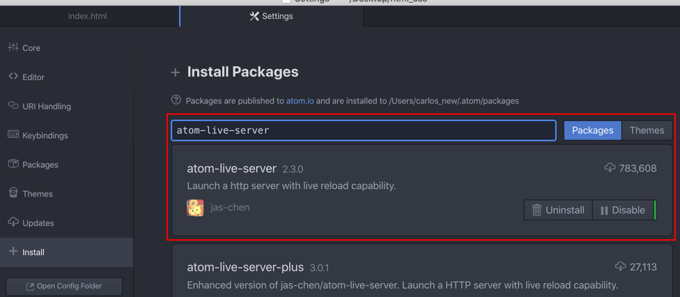
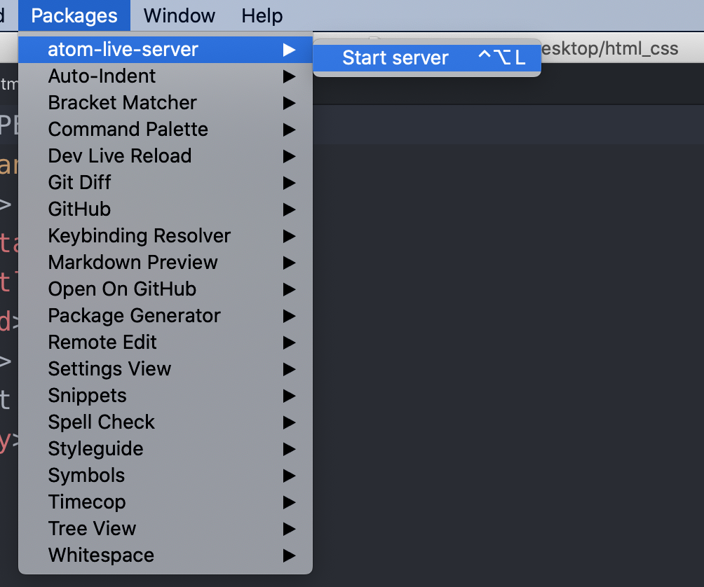

# 1.4 第一個網頁

## 練習：第一個網頁

使用編輯器，在 **html\_css** 建立一個 **practice** 資料夾，以做練習用。

然後在 **practice** 資料夾裡，新增以下四個資料夾及一個 index.html 檔案：

* css/                ←「 **/** 」表示這是一個資料夾，建立 css 資料夾。
* fonts/
* images/
* js/
* index.html     ← 這是檔案，副檔名為「**html**」。

### 第一步：撰寫 html

編輯 index.html

```markup
<!doctype html>
<html lang="zh-Hant">
  <head>
    <meta charset="utf-8">
    <title>這是網頁標題</title>
  </head>
  <body>
    <h1>這是內文標題</h1>
  </body>
</html>
```

寫好後，用瀏覽器開啟看看。index.html 點擊兩下，可於瀏覽器中直接開啟。課堂上建議先使用 Chrome。

### 第二步：撰寫 CSS

以下原始碼放在 `</head>` 結尾標籤之前：

```markup
<style>
  h1{
    color: red;
  }
</style>
```

### 第三步：撰寫 JS

以下原始碼放在 `</body>` 結尾標籤之前：

```markup
<script>
  var h1 = document.getElementsByTagName("h1")[0];
  h1.addEventListener("click", function(){
    alert("open dialog");
  });
</script>
```

這門課不會上到 JavaScript，但還是先瞭解基本的放置位置。

### 最後完成的一個網頁

```markup
<!doctype html>
<html lang="zh-Hant">
  <head>
    <meta charset="utf-8">
    <title>這是網頁標題</title>
    <style>
    h1{
      color: red;
    }
    </style>
  </head>
  <body>
    <h1>這是內文標題</h1>

    <script>
      var h1 = document.getElementsByTagName("h1")[0];
      h1.addEventListener("click", function(){
        alert("open dialog");
      });
    </script>
  </body>
</html>
```

即完成了一個有 HTML、CSS、JavaScript 網頁。


觀察：

1、瀏覽器開啟的頁面

2、滑鼠右鍵 → 檢視原始碼


## 使用 Atom 安裝 atom-live-server

Atom → Preferences → Install → 輸入「atom-live-server」



安裝好後，也有加進專案資料夾，就可以開啟本機端伺服器：



就產生了 **`http://127.0.0.1:3000`** 網址。


## 使用 Atom 安裝 auto-indent

同上步驟，Atom → Preferences → Install → 輸入「auto-indent」。

