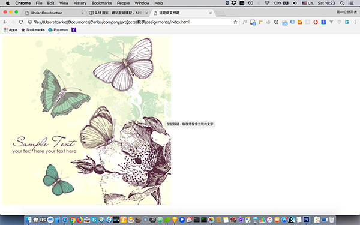
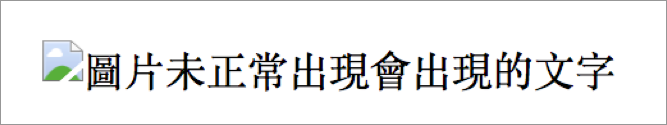

# 2.17 圖片

``：src 為圖片的路徑。img 是 **im**a**g**e 的縮寫。沒有結尾標籤。

## 語意

圖片。

## 常用屬性

```markup

```

## 範例 1

正常圖片顯示，以及滑鼠移過後，出現 **title** 的文字。

```markup

```

結果呈現





## 路徑

絕對路徑：

```markup

<!-- 或 -->

```

相對路徑：

```markup

<!-- 或 -->

```

**..**：代表上一層資料夾

**.**：代表當前資料夾

## 範例 2

圖片末正常出現時，顯示 **alt** 的文字。

```markup

```

結果呈現：




練習：瞭解 img 標籤的 alt 、title 的差異，及 src 路徑的使用方式。各家瀏覽器出現的狀況會不同，例： Safari 瀏覽器。


[暫時性的假圖](https://via.placeholder.com/300x200)

