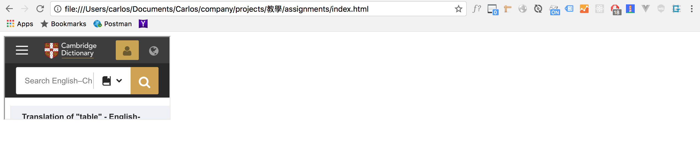
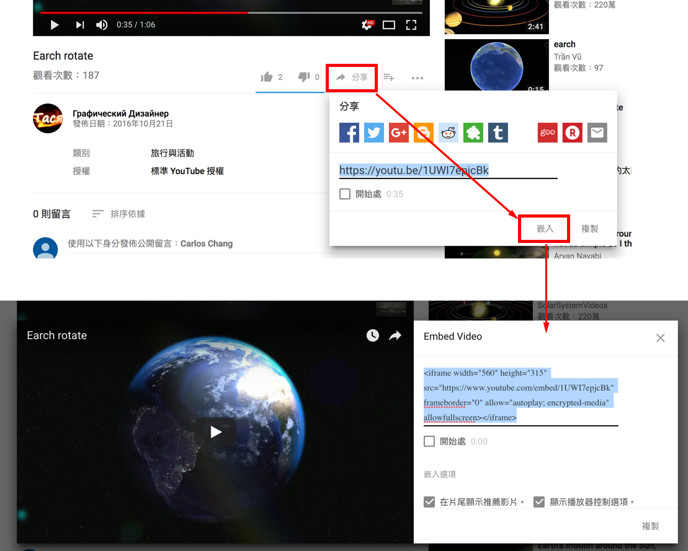
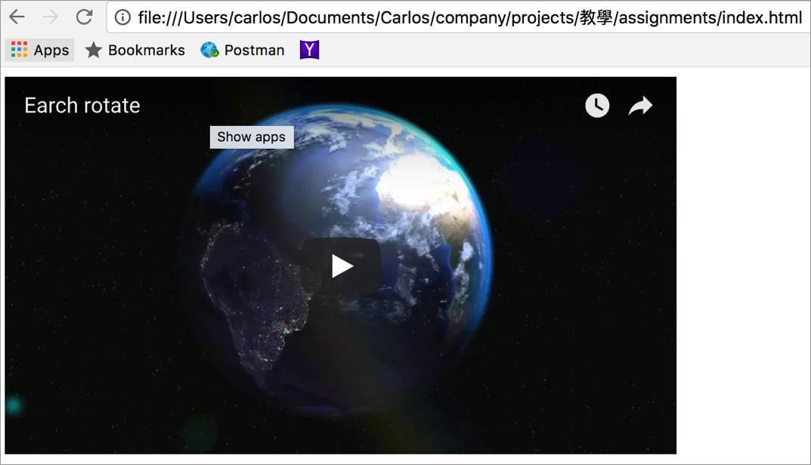

# 2.20 嵌入外站

`<iframe>`：**i**nline **frame** 的縮寫。

## 語意

嵌入其他內容在目前的網頁，可以是網頁、影片等形式，最常應用在 youtube 提供的影片嵌入。

## 結構

```markup
<iframe src="#"></iframe>
```

## 常用屬性

```markup
<iframe src="#" width="100%" height="200px" frameborder="0"></iframe>
```

**width**：指定寬度，可以是 **%**、**px**。

**height**：指定高度，可以是 **%** 、**px**。

**frameborder**：是否要顯示邊框，**0** 表示不顯示，**1** 則為顯示。

## 範例 1

嵌入外部網站的內容

```markup
<iframe src="https://dictionary.cambridge.org/dictionary/english-chinese-traditional/table"></iframe>
```





## 範例 2

嵌入 youtube 影片



```markup
<iframe width="560" height="315" src="https://www.youtube.com/embed/1UWI7epjcBk" frameborder="0" allow="autoplay; encrypted-media" allowfullscreen></iframe>
```

結果呈現






練習：將範例原始碼貼至編輯器，用瀏覽器觀察。也試著載入其它網址，都一定可以顯示正常嗎？


[標案的案例](https://p.tainan.gov.tw/2vai)
