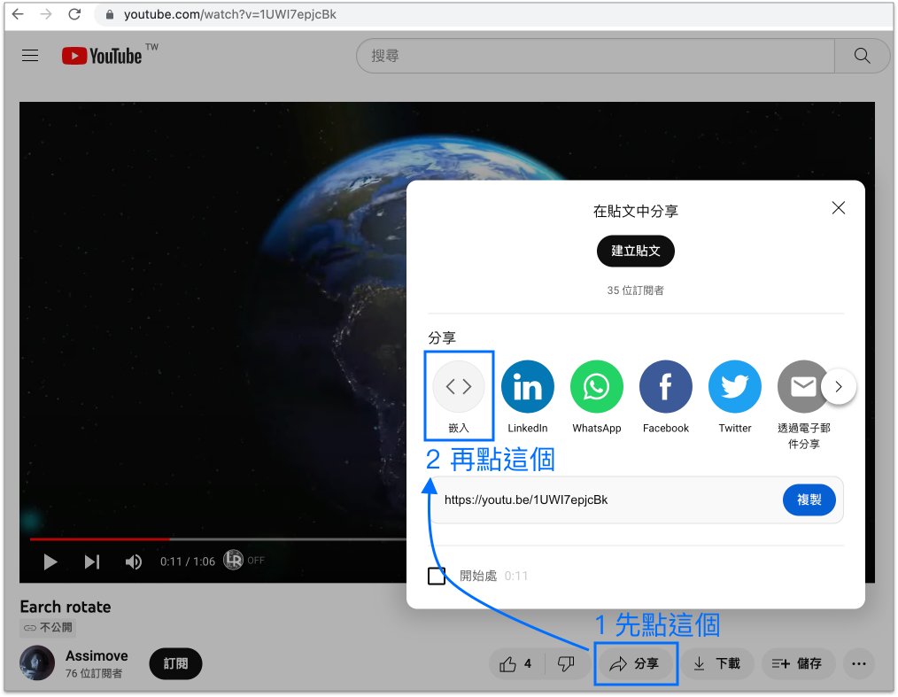
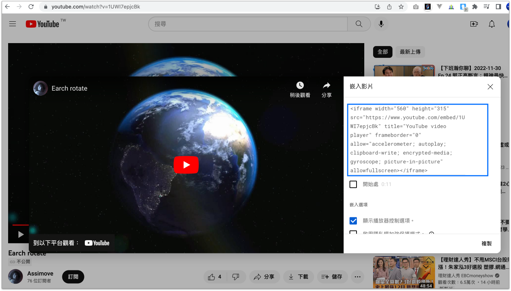

# 2.19 嵌入外站

`<iframe>`：**i**nline **frame** 的縮寫。

## 語意

嵌入其他內容在目前的網頁，可以是網頁、影片等形式，常見的有 YouTube 影片及 Google Map。


## 結構

```markup
<iframe src="#"></iframe>
```

## 範例 1

嵌入外部網站的內容

```markup
<iframe src="https://dictionary.cambridge.org/dictionary/english-chinese-traditional/table"></iframe>
```




## 範例 2

嵌入 youtube 影片，示意圖：

<figure><figcaption></figcaption></figure>

出現下圖，可複製 iframe 標籤：

<figure><figcaption></figcaption></figure>

例&#x20;

```markup
<iframe width="560" height="315" src="https://www.youtube.com/embed/1UWI7epjcBk" frameborder="0" allow="autoplay; encrypted-media" allowfullscreen></iframe>
```


結果呈現




