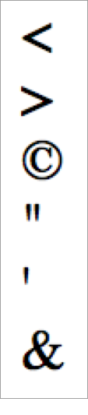

# 2.25 HTML Entity\(實體\)

如遇特殊符號，可嚐試使用 HTML Entity 來顯示，例：

```markup
<body>
  &lt;
  <br>
  &gt;
  <br>
  &copy;
  <br>
  &quot;
  <br>
  &apos;
  <br>
  &amp;
</body>
```

結果呈現：



## 資源

[所有 HTML Entities](https://www.freeformatter.com/html-entities.html)


練習 HTML Entities


