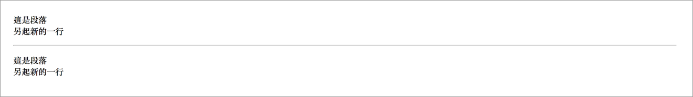

# 2.10 斷行與水平分隔線

共同特性：**沒有結束標籤**。

## 斷行 - \<br>

`<br>`：**br**eak 的縮寫。

語意：表示另起新的一行。

範例：

```markup
<p>這是段落<br>另起新的一行</p>
```

結果呈現：


## 水平分隔線 - \<hr>

`<hr>`：**h**orizontal **r**ule 的縮寫。

範例：

```markup
<p>這是段落<br>另起新的一行</p>
<hr>
<p>這是段落<br>另起新的一行</p>
```

結果呈現：




練習：將以上範例，貼至瀏覽器觀察。瞭解 br 及 hr 標籤。


