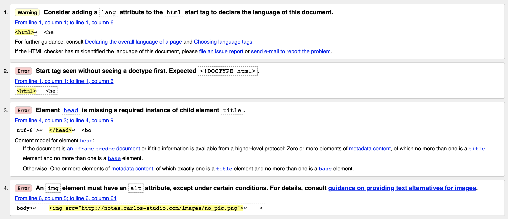

# 2.24 結構練習二

## 使用 W3C Markup Validation 服務

使用 [W3C Markup Validation](https://validator.w3.org/#validate\_by\_input) 服務，驗證自己寫的 html 是否可優化的空間。

將以下的 html，整個複製：

```markup
<html>
  <head>
    <meta charset="utf-8">
  </head>
  <body>
    
    <p>段落</p>
  </body>
</html>
```

貼到 「Validate by Direct Input」, 結果出現如下圖 4 個訊息，請嚐試修正：


