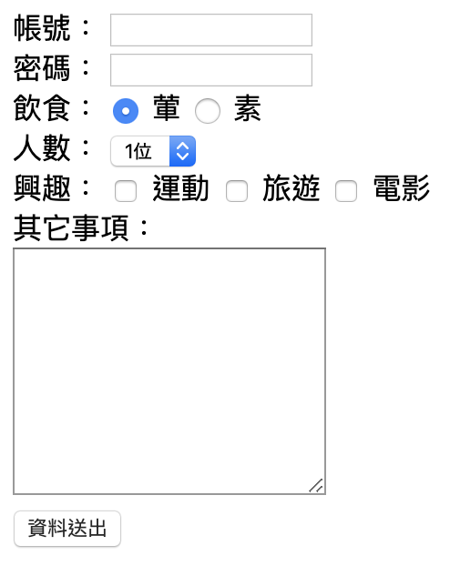
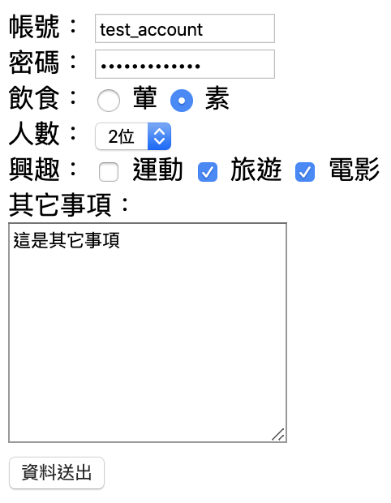
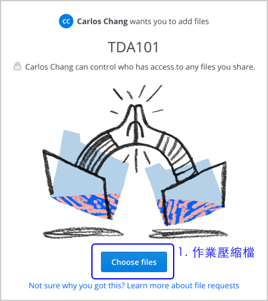
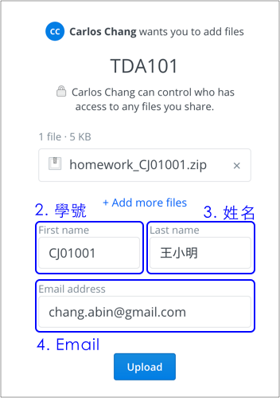

# 2.33 作業一

## 建立一個網頁，檔名 form.html，建立如下表單：

請在 `html_css` 資料夾下，建立 `assignment1` 資料夾，再建立 `form.html` 檔案。

注意事項：

* form 標籤的 action 屬性，設定成 `http://notes.carlos-studio.com/ex.php`。method 屬性，設定成 `get`。
* 帳號 name="username"；密碼 name="password"；飲食 name="food\_type"，「葷」 這個的 value 請設定成「葷」；「素」 這個的 value 請設定成「素」。
* 人數 name="num" 的下拉選單，建立「1位」、「2位」、「3位」。分別 option 的value 為 1、2、3。
* 興趣：input 的 `type="checkbox"`，`name="habits[]"`，value 分別是 **`運動`**、**`旅遊`**、**`電影`**。
* 其它事項 name="notes"。
* 飲食 radio button 及興趣 checkbox，請優化點擊範圍，點擊文字，也要能選得到。
* 資料送出的按鈕，type 設定成 `submit`。
* 密碼欄位，type 為 `password`。

完成示意圖：

假設輸入以下資料，點擊「資料送出」按鈕後：

結果應如下圖\(觀察網址\)：

參考：[Percent-encoding](https://en.wikipedia.org/wiki/Percent-encoding)

`%20`：網址上若出現，代表空格的意思。

參考作法：

[https://alldata.sgp1.digitaloceanspaces.com/sample/html\_css\_assignment1.zip](https://alldata.sgp1.digitaloceanspaces.com/sample/html_css_assignment1.zip)

## 作業繳交

### 方式一：Tibame 平台 \(ED103 使用\)

### 方式二：FTP

繳交檔案名稱為 **form.html** ，上傳至 ftp。

進到 FTP 的 「ED103作業」→「網頁入門」→「自己的學號」→建立「作業一」資料夾。上傳至此。

例：學號為 T19xxx：

* ED103作業/網頁入門/**T19xxx/作業一/form.html**

\*\*\*\*

### **方式三：Dropbox**

先將 `assignment1` 資料夾壓成壓縮檔，然後點擊這個[網址](https://www.dropbox.com/request/FfZC9jKUH872OdjoRONg)，再按照以下示意圖繳交：

一、選擇壓縮檔

二、基本資料填寫，按 `Upload` 上傳。

## 觀察 post 資料傳遞

form 標籤的 action 屬性，請改成 `http://notes.carlos-studio.com/ex_post.php`。method 屬性，設定成 `post`。

