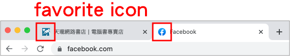

# 3.1 套用 CSS

套用 CSS，讓原來沒有任何外觀的 html，加上美麗的外觀，包含文字、版面佈局等等。主要常用的 CSS 套用方式有以下幾種：

## 方式一：行內套用

直接使用 style 屬性，加在 html 的標籤內。但因為這樣會使得 html 過於雜亂，建議少用。

```markup
<p style="color: blue;font-size: 30px;">這是段落，使用 屬性 style 來改變文字樣式。</p>
```

## 方式二：嵌入套用

在 html 當中，寫在 `<style>...</style>` 之中。可以在頁面的任何地方出現，但建議一般會放在 `<head>...</head>` 之中，這樣在內容出現時，就會是已經套用的形式。

```markup
<head>
  
  <!-- 其它 code... -->
  
  <style>
    p{
      color: blue;
    }
  </style>
</head>
```

## 方式三：外部套用

一般來說，html、css，會建議寫在各自的檔案，以讓 html 儘可能保持乾淨不雜亂。例：

* index.html
* css/index.css

**index.css** 的內容如下：

```css
p{
  color: blue;
}
```

而 **index.html** 要載入 **index.css** 這個外部檔案的方式如下：

```markup
<head>
  <link href="./css/index.css" rel="stylesheet">
</head>
```

注意 `<link>` 是**沒有**結尾標籤的。**href** 是 **H**ypertext **Ref**erence，**rel** 是 **rel**ationship 的縮寫。

## 方式四：使用 @import 語法

在 CSS 檔案中，使用 `@import` 語法，也可以引入其它 CSS 檔案。

假設 `index.css` 要載入 `abc.css` 這個檔案，則：



```css
p{
  color: red;
}
```



```css
@import "./abc.css";

/*
  其它 CSS
*/
```




## Favorite Icon

頁籤上的小 icon：



在 console 中若看到以下錯誤訊息，就代表沒有給定小 icon 圖片：


若想自訂小 icon 圖片，就在 `<head>` 區段裡面，加上以下原始碼，然後將 `href` 的屬性值設定正確的圖片路徑即可(註：圖片準備 png 檔，寬高皆 `32px` 即可)：

```markup
<link href="圖片路徑" rel="shortcut icon">
```
