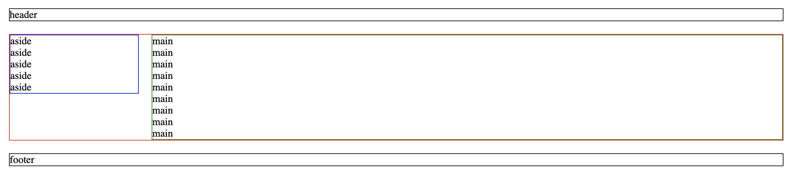

# 3.11 排版練習 - 固定式版型

## 練習一：二欄固定式版型

請在 `practice` 資料夾，建立 `two_columns.html` 來撰寫：

* 整體寬度 1200px 置中。
* 間距都設定 20px。
* 側邊欄 200px。


下圖是完成結果：



提供 html：

```markup
<header class="header">
  header
</header>

<div class="parent_container">
  <aside class="aside">
    aside<br>
    aside<br>
    aside<br>
    aside<br>
    aside<br>
  </aside>

  <main class="main">
    main<br>
    main<br>
    main<br>
    main<br>
    main<br>
    main<br>
    main<br>
    main<br>
    main<br>
  </main>
</div>

<footer class="footer">
  footer
</footer>
```

額外提示：

* 寬度計算：`width: calc(100% - 200px - 20px);`。()
* 空格消除：`font-size: 0;`。
* 區塊水平方向置中：`margin: 0 auto;`。


參考作法：



##

## 練習二：三欄固定式版型


