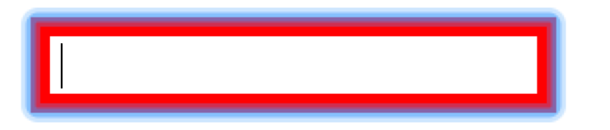
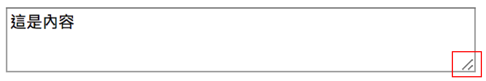
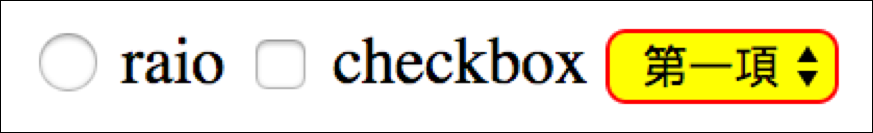
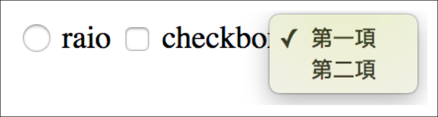

# 3.26 表單樣式

## 文字欄位

`:focus`：擬似類別，某欄位取得滑鼠焦點時。也可應用在其它輸入框，例： `textarea` 等。

HTML

```markup
<input type="text" class="the_text">
```

CSS

```css
input.the_text:focus{
  border:5px solid red;
}
```

結果呈現：



上圖的藍框可以透過 outline 來改變或移除。

```css
input.the_text:focus{
  border:5px solid red;
  
  /* 加上以下這行就可移除 */
  outline: none;
}
```

## 多文字欄位

HTML

```markup
<textarea rows="3" cols="50">這是內容</textarea>
```

CSS

```css
textarea{
  /* resize: both; */
}
```

結果如下：



resize 可選的值有：

* both：這是預設。使用者可改變 textarea 欄位的寬高。
* horizontal：使用者可水平將 textarea 欄位變寬。
* vertical：使用者可垂直將 textarea 欄位變高。
* none：使用者無法改變 textarea 欄位的寬高。

## 留意：預設難以客製化的項目

* 單選框\(type="radio"\)：radio 邊框、背景等皆無法改變。
* 核取框\(type="checkbox"\)：checkbox 邊框、背景等皆無法改變。
* 下拉選單\(select\)：僅能部份改變。\(option 項目無法改變。\)





這些項目若要有比較特別的介面，都需要高度客製化，都需再撰寫 html、css 、js 來做介面。

## 練習

1、大量練習 → 「介面 - 自訂核取方塊\(checkbox\) - 換圖」。


