# 3.19 背景樣式

## background-color 背景單色

也以使用各種顏色格式：16 進位代碼、rgba、hsla 等。

```css
div{
  background-color: red;
  /* 或 */
  background-color: #aabbcc;
  /* 或 */
  background-color: rgba(50, 50, 50, 1);
  /* 或 */
  background-color: hsla(120deg, 50%, 50%, 1)
}
```

## background-image 背景圖片

有一張圖片：

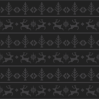

然後針對整個網頁\(或任何元素區塊皆可\)，撰寫以下 CSS：

```css
body{
  background-image: url("https://alldata.sgp1.digitaloceanspaces.com/images/christmas-dark.png");
}
```

結果呈現：會發現此圖在 &lt;body&gt; 區域內，不斷地水平、垂直反覆出現圖片。

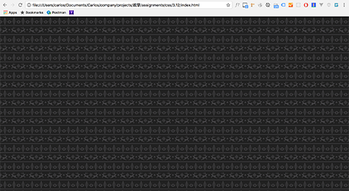

## **background-repeat 設定圖片的重覆狀態**

```css
body{
  background-image: url("https://alldata.sgp1.digitaloceanspaces.com/images/christmas-dark.png");
  background-repeat: no-repeat; /* repeat-x repeat-y */
}
```

可選的值有：

* `repeat`：預設，指的是圖片向 x 軸、y 軸反覆出現。
* `repeat-x`：圖片向 x 軸反覆出現。
* `repeat-y`：圖片向 y 軸反覆出現。
* `no-repeat`：不反覆出現，只出現一次。

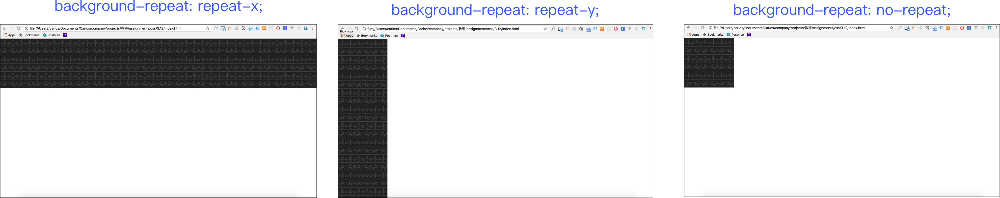

範例：




## 背景圖片相關屬性

有一張圖片，大小為 寬 640px、高 428px：


撰寫如下：

```markup
<!doctype html>
<html>
  <head>
  <meta charset="utf-8">
  <title>這是網頁標題</title>
  <style>
    div.place_img{
      width: 300px;
      height: 300px;
      border:1px solid red;
      background-image: url("https://alldata.sgp1.digitaloceanspaces.com/images/lion.jpg");
      background-repeat: no-repeat;
    }
  </style>
  </head>
  <body>
    <div class="place_img">這是 div 的內容</div>
  </body>
</html>
```

結果如下：背景圖超過 div 的區域，會被遮掉看不到。

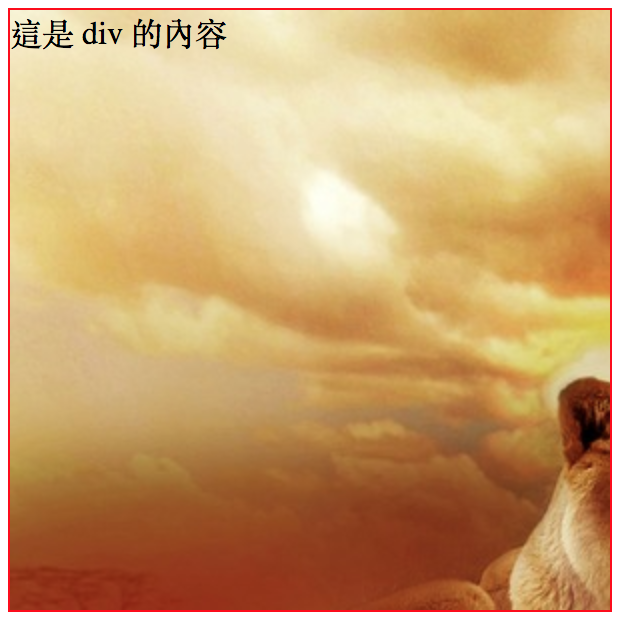

### **background-size** 設定背景圖大小

```css
div.place_img{
  width: 300px;
  height: 300px;
  border:1px solid red;
  background-image: url("./images/lion.jpg");
  background-repeat: no-repeat;
  
  /* 背景圖的寬度會變成佔 div 區域寬度的 80%。 */
  background-size: 80%;
  
  /*
  例：背景圖的寬度及高度會變成佔 div 區域的寬高都 50%，圖片會變形。
  background-size: 50% 50%;
  
  例：背景圖寬高顯示固定單位，寬為 150px，高為 100px。
  background-size: 150px 100px;
  */
}
```

結果呈現：

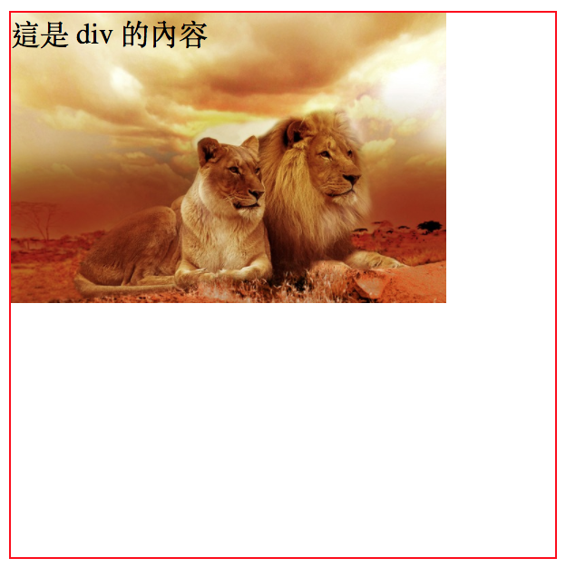

特殊關鍵字\(**contain**\)：\(背景圖片 「寬」或「高」 其中一個會變成 100%，讓圖片在**區域內能夠全部出現**，不能被遮到。\)

```css
div.place_img{
  width: 300px;
  height: 300px;
  border:1px solid red;
  background-image: url("./images/lion.jpg");
  background-repeat: no-repeat;
  
  /* 背景圖在該區域內要完整出現(寬或高其中一個會是 100%) */
  background-size: contain;
}
```

結果呈現：

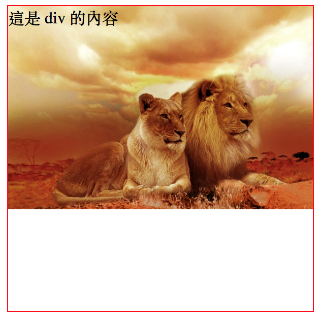

如果將 div 的高度改成 100px 的話，則結果會變成：

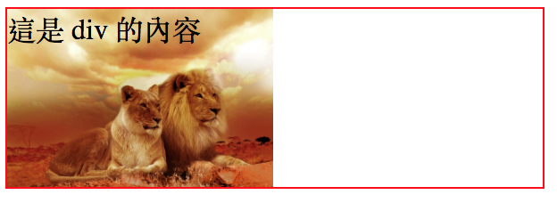


特殊關鍵字\(**cover**\)：\(背景圖片 「寬」或「高」 其中一個會變成 100%，讓圖片能夠**佔滿整個區域**，圖片會有部份被遮到。\)

```css
div.place_img{
  width: 300px;
  height: 300px;
  border:1px solid red;
  background-image: url("./images/lion.jpg");
  background-repeat: no-repeat;
  
  /* 背景圖要完整覆蓋該區域(寬或高其中一個會是 100%)，背景圖超出去的部份會被遮掉。 */
  background-size: cover;
}
```

結果如圖：

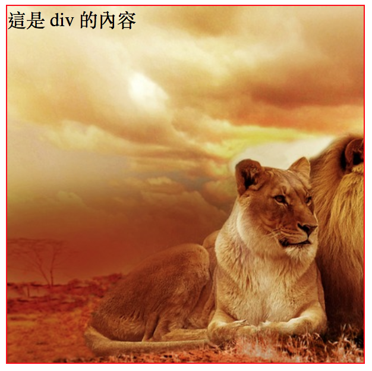

範例：




### **background-position** 設定背景圖位置

```css
div.place_img{
  width: 300px;
  height: 300px;
  border:1px solid red;
  background-image: url("./images/lion.jpg");
  background-repeat: no-repeat;
  background-size: 80%;
  
  /* 水平方向：置中；垂直方向：置底 */
  background-position: center bottom;
}
```

結果如圖：

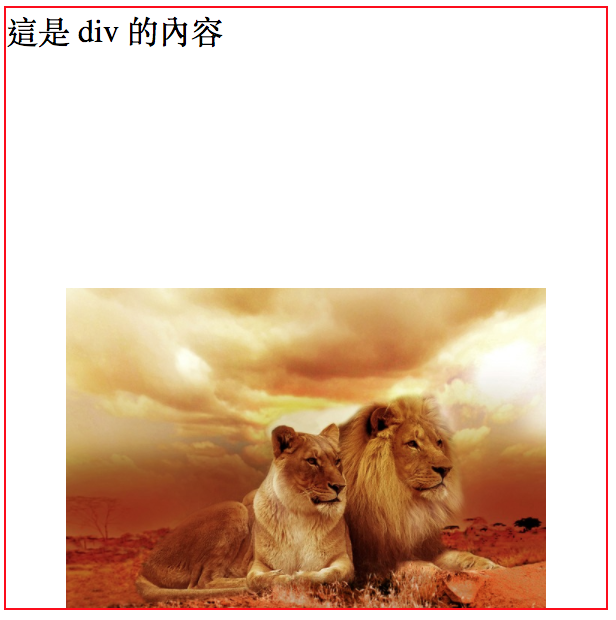

所以該圖在區域內，搭配關鍵字的話，共有以下幾種組合：

```css
background-position: left top; /* 水平方向：置左；垂直方向：置頂 */
background-position: center top; /* 水平方向：置中；垂直方向：置頂 */
background-position: right top;  /* 水平方向：置右；垂直方向：置頂 */
background-position: left center;    /* 水平方向：置左；垂直方向：置中 */
background-position: center center;  /* 水平方向：置中；垂直方向：置中 */
background-position: right center;   /* 水平方向：置右；垂直方向：置中 */
background-position: left bottom;    /* 水平方向：置左；垂直方向：置底 */
background-position: center bottom;  /* 水平方向：置中；垂直方向：置底 */
background-position: right bottom;   /* 水平方向：置右；垂直方向：置底 */
```

也可以指定水平方向、固定方向的距離，單位可以是 px 或 %：

```css
/* 水平方向：離左側 50px 的距離；垂直方向：離上側 10px 的距離 */
background-position: 50px 10px;
```

結果如圖：

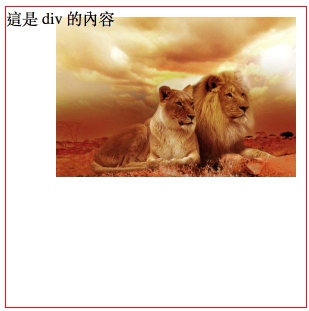


也可以指定以下，表示距離右側 10px；距離下方 20px：

```css
background-position: right 10px bottom 20px;
```




### background-attachment 固定背景圖片

有固定的模式，有以下三種：

* `scroll`：\(預設\)，背景圖會隨著頁面滑動而跟著滑動，元素內則不會。
* `local`：元素區域內滑動則**會**跟著滑動。
* `fixed`：背景圖會固定在網頁的可視區域\(viewport\)。不管自己元素內、或頁面滑動，該背景圖皆不會滑動。


scroll\(預設\)：

背景圖會隨著頁面滑動而跟著滑動；元素區域內滑動則不會跟著滑動。




local：

元素區域內滑動則會跟著滑動。




fixed\(行動版瀏覽器不支援\)：

背景圖會固定在網頁的可視區域。






### background-origin 設定背景圖顯示的區域

* `padding-box`：\(預設值\)。設定圖片顯示區域是從 padding 區域開始。
* `border-box`：設定圖片顯示區域是從 border 區域開始。
* `content-box`：設定圖片顯示區域是從 content 區域開始。

範例：




### background-clip 設定背景圖裁切的區域

* `padding-box`：設定圖片顯示區域到 padding 區域，其它裁切。
* `border-box`：\(預設值\)。設定圖片顯示區域是到 border 區域，其它裁切。
* `content-box`：設定圖片顯示區域是到 content 區域，其它裁切。

範例：




## background 背景圖片線性漸層色

```css
background: linear-gradient(方向, 顏色停止點1, 顏色停止點2, ...);
```

方向可選的有：

* to bottom：這是預設值。
* to top
* to right
* to left
* to bottom right
* to bottom left
* to top right
* to top left
* 40deg \(代表 `to 40 度` 的方向\)

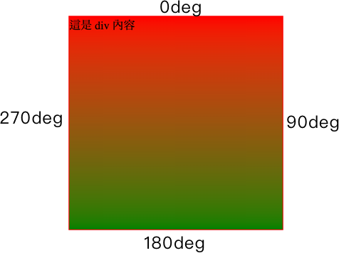

範例：




關於顏色停駐點：

1、紅色在 30px 的位置，綠色也在 30px 的位置，沒有任何漸層效果發生；0px ~ 30px 由紅色填滿；30px到最後，由綠色填滿：

```css
background: linear-gradient(red 30px, green 30px);
```

2、紅色在 30px 的位置，綠色在 40px 的位置，30px ~ 40px 這個區域，紅色到綠色漸層；0px ~ 30px 由紅色填滿，40px 到最後由綠色填滿：

```css
background: linear-gradient(red 30px, green 40px);
```

3、30px 到 40px 由紅色變到綠色；40px 到 250px 由綠色變到黃色：\(推理方式同上\)

```css
background: linear-gradient(red 30px, green 40px, yellow 250px);
```

範例：



範例參考：[5breakfast](https://5breakfast.com/)


## 一個區域可以疊多張背景圖

可以直接參考[這個例子](https://www.w3schools.com/css/tryit.asp?filename=trycss3_background_multiple)，即各屬性值以半形逗號做區隔。


## 資源

[uiGradients](https://uigradients.com/#Vasily)

[Gradient CSS Generator](https://www.cssmatic.com/gradient-generator)


