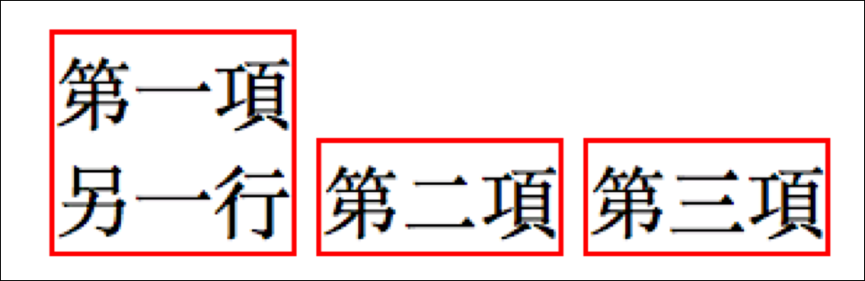
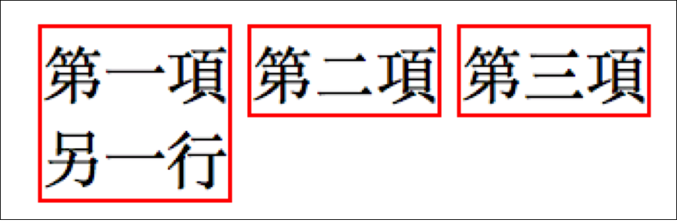
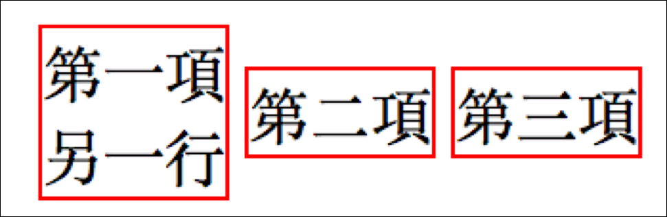

# 3.10 排版 - 關於 vertical-align 對齊

## 範例一：常用屬性值認識

* baseline：字母 x 下緣處，就叫做基準線。(這是預設值)
* top
* middle
* bottom


## 範例二：縫隙問題

div 標籤內，僅一張圖。



## 範例三(重要)：同層對齊

同一個層級的元素當中，垂直方向的對齊方式。主要有三個可設定的值：

* top：垂直方向的對齊位置，上方對齊。
* middle：垂直方向的對齊位置，中間對齊。
* bottom：垂直方向的對齊位置，下方對齊。

```markup
<!doctype html>
<html>
  <head>
    <meta charset="utf-8">
    <title>這是網頁標題</title>
    <style>
      ul li{
        display: inline-block;
        border:1px solid red;
      }
    </style>
  </head>
  <body>
    <ul>
      <li>第一項<br>另一行</li>
      <li>第二項</li>
      <li>第三項</li>
    </ul>
  </body>
</html>
```

結果如圖：(發現「第二項」、「第三項」都到下方了，通常可透過修改 `vertical-align` 來改變對齊方式)



將上述的 CSS 部份改成：

```css
ul li{
  display: inline-block;
  border:1px solid red;

  /* 垂直方向的對齊方式：上方對齊 */
  vertical-align:top;
}
```



若將 vertical-align 改成 **middle**，則：



範例：


