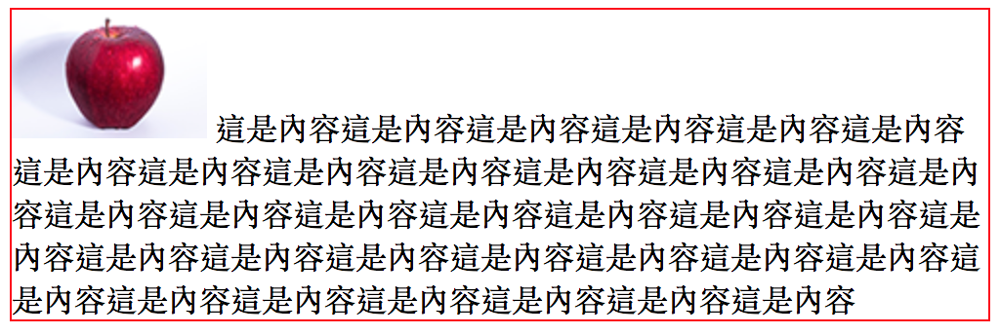
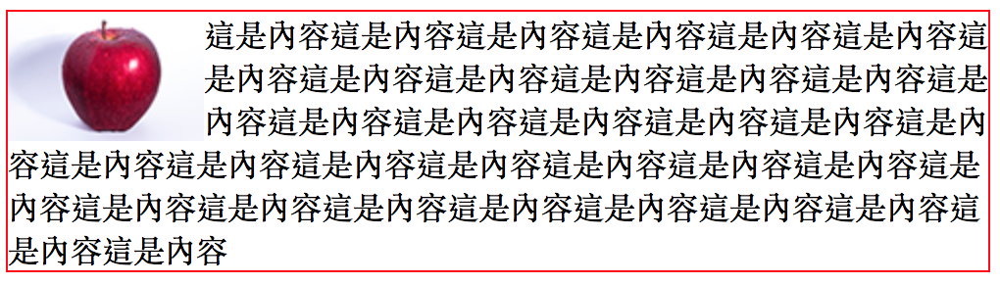
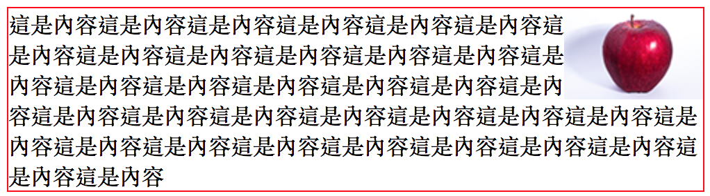
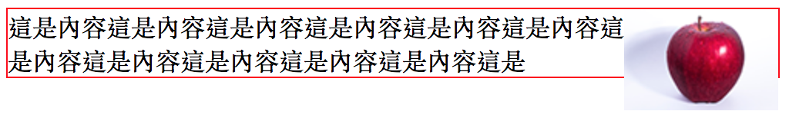

# 3.20 排版 - 關於浮動(float)

決定一個元素，在某區域的浮動狀態，可設定的值有：

* none：這是預設值
* left
* right

請先下載圖片(按右鍵另存新檔即可)：


## 浮動基本範例

HTML：

```markup
<div class="first">
  
  這是內容這是內容這是內容這是內容這是內容這是內容這是內容這是內容這是內容這是內容這是內容這是內容這是內容這是內容這是內容這是內容這是內容這是內容
</div>
```

CSS：

```css
div.first{
  width: 500px;
  border:1px solid red;
}
```

結果(這是預設情況)：



CSS 變更成：

```css
div.first{
  width: 500px;
  border:1px solid red;
}

/* 新增以下 */
div.first img{
  float:left;
}
```

結果：



CSS 再變更成：

```css
div.first{
  width: 500px;
  border:1px solid red;
}

/* 新增以下 */
div.first img{
  float: right;
}
```

結果：




## 浮動的問題

當浮動區域的高度超出父層的高度時，父層的高度並不會增加，例：

HTML：

```markup
<div class="first">
  
  這是內容這是內容這是內容這是內容這是內容這是內容這是內容這是內容這是內容這是內容這是內容這是
</div>
```

CSS：

```css
div.first{
  width: 500px;
  border:1px solid red;
}
div.first img{
  float:right;
}
```

結果：發現紅框的高度，並沒有跟著圖片增加，因為該圖已設定成浮動元素



## 解法：使用 clear 及偽元素(Pseudo Element) `::after`

修改 CSS 如下：

```css
div.first{
  width: 500px;
  border:1px solid red;
}

div.first::after{
  content: "abc"; /* 設定內容作示意 */
  display: block;
  clear: both;    /* 設定此元素的左右側，都不能有任何浮動元素，若有的話，就一直往下掉，掉到沒有為止 */
}

div.first img{
  float:right;
}
```

例：




## 練習：使用浮動做固定二欄式排版

提供結構：

```html
<div class="parent_container">
  <div class="left_block">左側區塊<br>第二行</div>
  <div class="right_block">右側區塊</div>
</div>
```


參考作法：



