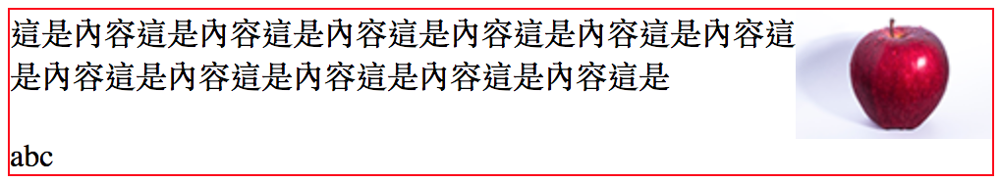

# 3.22 排版 - 關於浮動\(float\)

決定一個元素，在某區域的浮動狀態，可設定的值有：

* none：這是預設值
* left
* right

請先下載圖片\(按右鍵另存新檔即可\)：


## 範例

HTML：

```markup
<div class="first">
  
  這是內容這是內容這是內容這是內容這是內容這是內容這是內容這是內容這是內容這是內容這是內容這是內容這是內容這是內容這是內容這是內容這是內容這是內容
</div>
```

CSS：

```css
div.first{
  width: 500px;
  border:1px solid red;
}
```

結果\(這是預設情況\)：


CSS 變更成：

```css
div.first{
  width: 500px;
  border:1px solid red;
}

/* 新增以下 */
div.first img{
  float:left;
}
```

結果：


CSS 再變更成：

```css
div.first{
  width: 500px;
  border:1px solid red;
}

/* 新增以下 */
div.first img{
  float: right;
}
```

結果：


## 浮動的問題

當浮動區域的高度超出父層的高度時，父層的高度並不會增加，例：

HTML：

```markup
<div class="first">
  
  這是內容這是內容這是內容這是內容這是內容這是內容這是內容這是內容這是內容這是內容這是內容這是
</div>
```

CSS：

```css
div.first{
  width: 500px;
  border:1px solid red;
}
div.first img{
  float:right;
}
```

結果：發現紅框的高度，並沒有跟著圖片增加，因為該圖已設定成浮動元素


## 解法：使用 clear 及偽元素\(Pseudo Element\) `::after`

修改 CSS 成：

```css
div.first{
  width: 500px;
  border:1px solid red;
}
/* 增加 ::after 這個擬似元素 */
/*
 1、使用 div.first 的 ::after 偽元素。
 2、content 屬性的值，先設定 "abc" 做示意。
 3、將該元素設定成區塊元素(display: block)。
 4、使用 clear: both 來設定此元素的左右側，都不能有任何浮動元素。
*/
div.first::after{
  content: "abc";
  display: block;
  clear: both;
}

div.first img{
  float:right;
}
```

結果：



故將 `content: "abc";` 改成 `content: "";`，即變成：





## 範例：使用浮動做固定二欄式排版\(不建議\)




