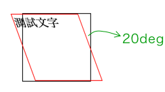
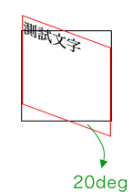

# 3.31 效果 - 轉換 transform

transform 2D 轉換效果共有四種，分別是：

* rotate：旋轉
* scale：縮放
* translate：偏移
* skew：傾斜

## rotate 旋轉

一個元素設定旋轉，單位 deg(度數)，然後原點是以元素的中心點來旋轉。度數是正的，就以順時針方向；反之則為逆時針方向。

可以透過 `transform-origin`，來改變旋轉的原點位置，例如以左上角。

元素旋轉後，並不會影響到周圍的元素。

語法：

```css
transform: rotate(20deg);  /* 順時針轉 20 度 */
transform-origin: 50% 50%; /* 這是預設值，元素的中心點 */
```

範例：



```markup
<div class="transform_block">
  <div class="transform_ele">測試文字</div>
</div>
```



```css
div.transform_block{
  border: 1px solid black;
  width: 100px;
  height: 100px;
  box-sizing: border-box;
  margin-left: 200px;
  font-size: 0;
}


div.transform_ele{
  font-size: 1rem;
  box-sizing: border-box;
  width: 100%;
  height: 100%;
  border: 1px solid red;
  
  transform: rotate(20deg); /* 順時針旋轉 20 度 */
  transform-origin: 0% 0%; /* 原點位置：這裡改變為左上角 */
}
```





## scale 縮放

語法：

一個元素設定縮放，預設是 1。可設定大於等於0的小數、整數。

可以透過 `transform-origin`，來改變縮放的原點，例如以左上角。

元素縮放後，並不會影響到周圍的元素。

```css
transform: scale(1.5);  /* 原來的 1.5 倍 */
transform-origin: 50% 50%; /* 這是預設值，元素的原點 */
```

也可以只針對單一方向來縮放：

```css
transform: scaleX(1.5); /* 水平方向 */
```

```css
transform: scaleY(1.5); /* 垂直方向 */
```

範例：



```markup
<div class="transform_block">
  <div class="transform_ele">測試文字</div>
</div>
```



```css
div.transform_block{
  border: 1px solid black;
  width: 100px;
  height: 100px;
  box-sizing: border-box;
  position: relative;
  margin-left: 200px;
  margin-top: 100px;
  font-size: 0;
}
div.transform_ele{
  font-size: 1rem;
  box-sizing: border-box;
  width: 100%;
  height: 100%;
  position: absolute;
  border: 1px solid red;
  
  transform: scale(1.2);   /* 試試看 scaleX、scaleY */
  transform-origin: 0% 0%; /* 原點位置：這裡改變為左上角 */
}
```





## translate 偏移

設定相對於自己原來的位置，設定要如何水平方向、垂直方向的偏移。

語法：第一個參數是水平方向(x 軸)的偏移，第二個參數是垂直方向(y 軸)的偏移：

```css
transform: translate(20px, 10px); /* 往右移動 20px，往下移動 20px */
```

```css
transform: translate(50%, 50%); /* 往右移動自己寬度的一半，往下移動自機高度的一半 */
```

如果是只想設定其中一個方向就好，可以使用以下語法(`translateX`、`translateY` )：

```css
transform: translateX(10px); /* 設定水平方向偏移，往右移 10px */
```

```css
transform: translateY(50%); /* 設定垂直方向偏移，往下移自己高度的一半 */
```

元素的偏移，並不會影響到周圍的元素。

範例：



```markup
<div class="transform_block">
  <div class="transform_ele">測試文字</div>
</div>
```



```css
div.transform_block{
  border: 1px solid black;
  width: 100px;
  height: 100px;
  box-sizing: border-box;
  position: relative;
  margin-left: 200px;
  margin-top: 100px;
  font-size: 0;
}
div.transform_ele{
  font-size: 1rem;
  box-sizing: border-box;
  width: 80px;
  height: 80px;
  position: absolute;
  top: 0;
  left: 0;
  border: 1px solid red;
  
  /*transform: translate(5px, 5px);*/
  
  
  /* 水平、垂直置中 */
  top: 50%;
  left: 50%;
  transform: translate(-50%, -50%);
  
}
```






## skew 傾斜

語法：第一個參數是針對 x 軸方向傾斜，第二個是 y 軸方向傾斜

```css
transform-origin: 0% 0%; /* 改變原點位置 */
transform: skew(10deg, 0deg);
```

假設 `skew(20deg, 0deg)`：



假設 `skew(0deg, 20deg)`：




範例：



```markup
<div class="skew_block">
  <div class="skew_ele">測試文字</div>
</div>
```



```css
div.skew_block{
  border: 1px solid black;
  width: 100px;
  height: 100px;
  box-sizing: border-box;
  margin-left: 200px;
  margin-top: 100px;
  font-size: 0;
}
div.skew_ele{
  font-size: 1rem;
  box-sizing: border-box;
  width: 100%;
  height: 100%;
  border: 1px solid red;
  
  /*
  transform-origin: 0% 0%;
  transform: skew(10deg, 0deg);
  */
}
```






## 同時套用多種 transform 效果

不能寫多個 transform，而是寫在同一個 transform，且用**空格**做分隔。

語法：

```css
transform: scale(1.4) rotate(30deg);
```



