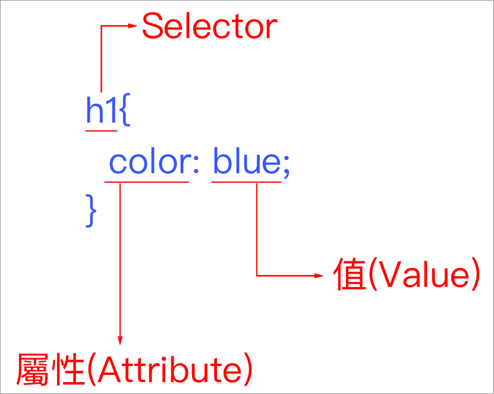

# 3.4 Selectors 1 - 屬性及值

Selectors 網路上看中文的話，常被翻譯成「選擇子」或「選取器」，僅供參考。

* **Selector**：指的是要套用至 html 的哪個元素。
* **Attribute(屬性)**：套用的元素，要改變什麼，例如文字顏色就是 **color**。
* **Value(屬性值)**：針對所選的屬性，要套用什麼值，例如color 的 **blue**，就是將文字顏色改成藍色。
* 一個元素，可被套用很多個屬性及其值。



## 用法一：指定屬性

加上中括號，中間是屬性名稱，此例來說，是 a 連結的 target 屬性：

```css
a[target]{
  color: red;
}
```



## 用法二：指定屬性值

a 連結的 target 值，等於 \_blank：

```css
a[target="_blank"]{
  color: blue;
}
```



## 用法三：指定屬性的起始值

a 連結的 href 屬性，起始值為 https 的：

```css
a[href^="https"]{
  color: red;
}
```



## 用法四：指定屬性值的結尾

p 段落的 name，屬性值結尾是 test：

```css
p[name$="test"]{
  color: red;
}
```



## 資源

[所有 CSS Selectors](https://www.w3schools.com/cssref/css\_selectors.asp)


練習上述所有 selectors 的用法。

