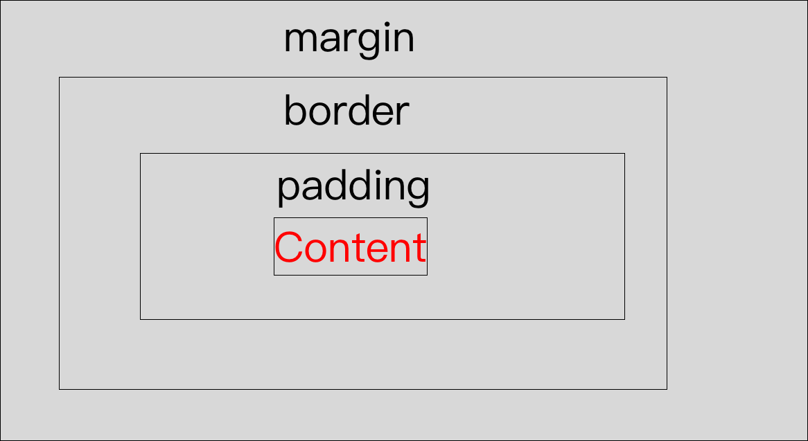
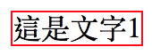
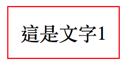
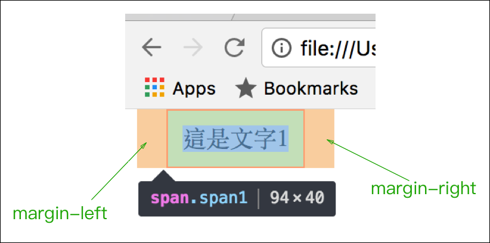
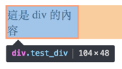
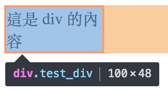

# 3.9 排版 - 區塊模型\(Box Model\)

## **認識 Box Model**

**margin**：border 往外的距離。

**padding**：內容與 border 的距離。

**border**：該元素的邊框。



### 範例

第一步：增加 **border**。

HTML：

```markup
<div class="div1">這是文字1</div>
```

CSS：

```css
.div1{
  /* 1px 的框線、實線、紅色 */
  border:1px solid red;
}
```



第二步：增加 **padding**。

更改 CSS 如下：

```css
.div1{
  /* 1px 的框線、實線、紅色 */
  border:1px solid red;

  /* 內容與框線的上、右、下、左，距離都是 10px */
  padding: 10px;
}
```



第三步：增加 **margin**。

更改 css 如下：

```css
.div1{
  /* 1px 的框線、實線、紅色 */
  border:1px solid red;

  /* 內容與框線的上、右、下、左，距離都是 10px */
  padding: 10px;

  /* 框線與上、右、下、左，距離都是 20px */
  margin: 20px;
}
```



觀察：



box model：觀察 inline 元素



## margin 和 padding 縮寫

分別都有:

* `margin-top`、`margin-right`、`margin-bottom`、`margin-left`
* `padding-top`、`padding-right`、`padding-bottom`、`padding-left`

```css
margin: 10px;                /* 上、右、下、左，皆 10px */
margin: 10px 20px;           /* 上、下皆 10px；左右皆 20px */
margin: 10px 20px 30px;      /* 上 10px；左右皆 20px；下 30px */
margin: 10px 20px 30px 40px; /* 按照上、右、下、左的順序，依序為 10px、20px、30px、40px */
```

padding 縮寫形式相同。

## 區塊大小\(box-sizing\)

常用的有兩個值：**content-box** 和 **border-box**：定義的是寬高從何處算起。

* `content-box`：設定 width 或 height 時，寬度、高度指的是內容寬。\(這是預設值\)
* `border-box`：設定 width 或 height 時，寬度、高度指的是從邊框也算進去，包含 padding。

html：

```markup
<div class="test_div">這是 div 的內容</div>
```

css：

```css
div.test_div{
  border:2px solid red;
  width: 100px;
}
```

結果如圖：\(可以得知實際寬度會是 104px。如果有 padding-left、padding-right的話，也會再加上padding 的寬度。\)



css 改成如下：

```css
div.test_div{
  border:2px solid red;
  width: 100px;

  /* 加上以下這行 */
  box-sizing: border-box;
}
```

結果如圖：\(可以發現寬度變成了 100px，也就是 border 及 padding 的寬度也會被包含在 width 所設定的寬度內。\)



練習，瞭解 box-sizing 對於寬度、高度的影響：




## 認識寬高長度單位

### 常用屬性

* width
* height
* min-width
* min-height
* max-width
* max-height

### 常用單位

* px：pixel。像素。例 50px
* %：百分比。例：50%
* vw：Viewport Width。視埠寬度。例：50vw
* vh：Viewport Height。視埠高度。例：50vh
* vmin：Viewport 的寬、高，取較小的那一個。例：50vmin
* vmax：Viewport 的寬、高，取較大的那一個。例：50vmax

範例：




