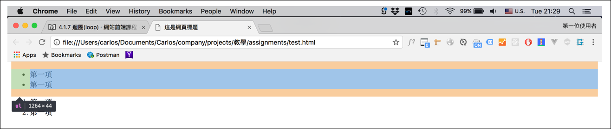
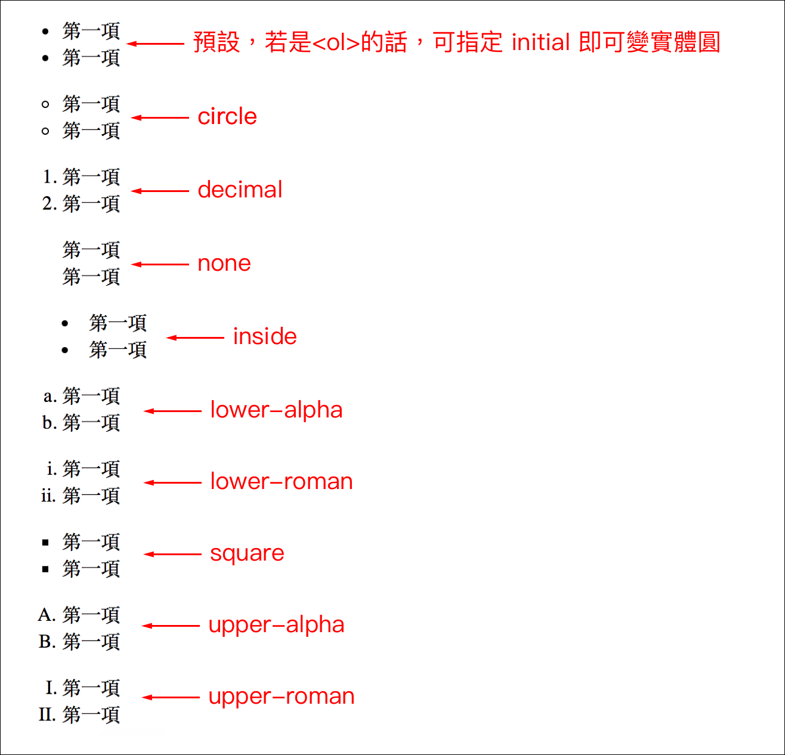

# 3.17 列表樣式

無序列表結構：

```markup
<ul class="unorder_list">
  <li>第一項</li>
  <li>第二項</li>
</ul>
```

有序列表結構：

```markup
<ol class="order_list">
  <li>第一項</li>
  <li>第二項</li>
</ol>
```

上面 html 的呈現結果：試著觀察預設的列表樣式。



## 列表相關 CSS 樣式

`list-style`：可選的常用值有 **circle**、**decimal**、**none**、**inside**、**lower-alpha**、**lower-roman**、**square**、**lower-alpha**、**lower-roman**。

```css
ul.unorder_list{
  list-style: circle;
}
```

可再藉由 **margin** 和 **padding** 將預設的樣式消息。例：

```css
ul.unorder_list{
  list-style: circle;
  margin:0;
  padding:0;
}
```

觀察預設的項目符號，改變 **`list-style`** 的屬性值：




## 範例：觀察 ul 及 ol 的預設 box model

請觀察 ul、ol 的預設 box model；以及 `list-style: inside;` 的作用。




