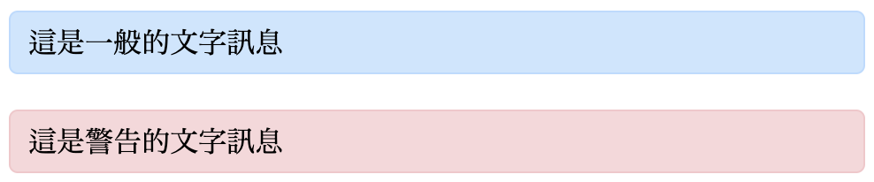
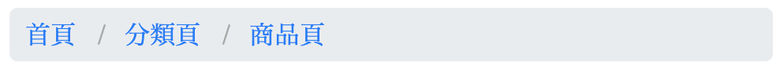
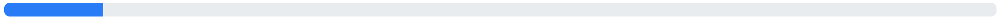

# 4 練習

## 1 介面 - Alerts

檔名建議：`alert.html`

說明：

* 藍色背景色 `#cce5ff`，邊框 1px 實線，邊框顏色 `#b8daff`。
* 紅色背景色 `#f8d7da`，邊框 1px 實線，邊框顏色 `#f5c6cb`。
* 內距(padding)：上下 5px、左右 10px。
* 圓角(border-radius)：5px。
* 藍色、紅色分別是一個 `div` 區塊即可。

結果示意圖：



提供 html：

```markup
<div class="alert">
  這是一般的文字訊息
</div>

<div class="alert -error">
  這是警告的文字訊息
</div>
```

參考作法：




## 2 介面 - Button 按鈕

檔名建議：`button.html`

說明：

* 請用 button 標籤( `type="button"` )製作。
* 文字大小 1rem、文字顏色 `#007bff`。邊框 1px 實線、邊框顏色 `#007bff`。
* 按鈕圓角(border-radius) `.25rem`。
* 按鈕內距(padding)：`.375rem .75rem` 。
* 滑鼠移過：文字顏色 `#FFF`。背景顏色 `#007bff`。
* 滑鼠移過游標(cursor)變成： `pointer`。

結果示意：



參考作法：




## 3 介面 - Breadcrumb 麵包屑

檔名建議：`breadcrumb.html`

說明：

* 最外層 `div`，裡面請用 `ol` 標籤製作。
* 連結文字顏色 `#007bff`，滑鼠移過後變成 `#0056b3`。
* 提示：斜線可用 `::before` 來創造，顏色為 `#aaa`。
* div 背景色為 `#e9ecef`，內距上下 5px、左右 10px。圓角 5px。

結果示意圖：



提供 html：

```markup
<div class="breadcrumb">
  <ol class="breadcrumb_list">
    <li><a href="#">首頁</a></li>
    <li><a href="#">分類頁</a></li>
    <li>商品頁</li>
  </ol>
</div>
```

參考作法：




## 4 介面 - 直向圖文編排

檔名建議：`text_vertical.html`

說明：

* 圖片路徑：[https://picsum.photos/id/729/500/300](https://picsum.photos/id/729/500/300)
* 圖片點擊開新分頁連至外站(任意網址皆可)。
* 最外層用 article 標籤製作。寬度 300px。
* 標題「農夫耕種的照片」用 h1 標籤製作。
* 標題文字大小 1.2rem。

結果示意圖：


參考作法：




## 5 介面 - 文繞圖

檔名建議：`text_float.html`

說明：

* 圖片路徑：[https://picsum.photos/id/729/500/300](https://picsum.photos/id/729/500/300)
* 圖片點擊開新分頁連至外站(任意網址皆可)。
* 最外層用 article 標籤製作。寬度 500px。
* 標題「農夫耕種的照片」用 h1 標籤製作。
* 標題文字大小 1.2rem。
* 提示1：比照「直向圖文編排」，在結構上只加了一個「圖片簡述的文字」，其餘結構完全不會變，只調整樣式。
* 提示2：連結區塊(灰框部份)設定成向左的浮動(float)。

結果示意圖：


參考作法：




## 6 介面 - Pagination 分頁

檔名建議：`pagination.html`

說明：

* 列表使用 ul 標籤。
* 框線顏色：`#dee2e6`。
* 文字顏色：`#dee2e6`。
* 滑鼠移過：背景色變成 `#e9ecef`；文字顏色變成 `#0056b3`。
* 假設在第1頁：那 1 的樣式，預設要與滑鼠移過時的狀態一樣。

結果示意：



參考作法：




## 7 介面 - 用 CSS 做三角形

檔名建議：`arrow_left.html`

說明：

* 假設是用 span 標籤做，可將四個邊框都設定成不同顏色，然後設定 10px 的實線(solid)，display 設定成 inline-block，寬高都設定 0。即可清礎看到箭頭。
* 顏色的完全透明，有一個關鍵字叫 `transparent`。

結果示意：


參考作法：




## 8 介面 - 按鈕 tooltip

檔名建議： `button_tooltip.html`

說明：

* 設定 tooltip 不要斷行：`white-space: nowrap`。

提供 html 結構：

```markup
<button type="button" class="btn">這是按鈕文字這是按鈕文字<span class="tooltip">這是提示文字</span></button>
```

結果示意：



參考作法：




## 9 介面 - Popover

檔名建議：`popover.html`

說明：

* popover 的背景色 `#fed`。邊框顏色 `rgba(0,0,0,.3)`。
* 三角形旋轉 45deg：`transform: rotate(45deg)`。
* 利用 `::before` 來做三角形。

提供 html 結構：

```markup
<label class="popover_label">
  <input type="text" placeholder="輸入帳號">
  <span class="popover">
    僅能輸入英文字母、數字、底線(_)。
  </span>
</label>
```

結果示意：



參考作法：




## 10 介面 - Input Group

檔名建議：`input_group.html`

說明：

* placeholder 文字設定為「輸入 Email」。
* :focus 狀態時，背景色改成 `hsla(200, 80%, 90%, 1)`。

提供 html：

```markup
<div class="input_group">
  <label>@</label>
  <input type="text" placeholder="輸入 Email">
</div>
```

結果示意：



參考作法：




## 11 介面 - List Group 列表群組

檔名建議：`list_group.html`

說明：

* 請用 ul 標籤來製作。
* 邊框顏色：`#ccc`。

結果示意：


參考作法：




## 12 介面 - Progress 進度條

檔名建議： `progress.html`

說明：

* 進度條的背景色為 `#e9ecef`。圓角(border-radius) 8px。
* 有進度的顏色背景為 `#007bff`。
* 要去想到後端工程師可能會怎麼帶資料。

結果示意：



提供 html：

```markup
<div class="progress_bar">
  <span class="progress" style="width: 20%;"></span>
</div>
  
<div class="progress_bar">
  <span class="progress" style="width: 70%;"></span>
</div>
```

參考作法：




## 13 介面 - 使用圖片客製化列表項目符號

檔名建議：`list_item_custom_img.html`

說明：

使用 ul 標籤完成下圖排版，將項目符號客製化：


圖片路徑：

[https://alldata.sgp1.digitaloceanspaces.com/images/checkmark.png](https://alldata.sgp1.digitaloceanspaces.com/images/checkmark.png)

參考作法：




## 14 版型 - 固定導覽列於左側側邊欄

檔名建議：`fixed_sidebar.html`

提供 html：

```markup
<aside class="aside">
  <ul class="aside_list">
    <li><a href="">連結1</a></li>
    <li><a href="">連結2</a></li>
    <li><a href="">連結3</a></li>
    <li><a href="">連結4</a></li>
    <li><a href="">連結5</a></li>
    <li><a href="">連結6</a></li>
    <li><a href="">連結7</a></li>
    <li><a href="">連結8</a></li>
    <li><a href="">連結9</a></li>
    <li><a href="">連結10</a></li>
    <li><a href="">連結11</a></li>
    <li><a href="">連結12</a></li>
    <li><a href="">連結13</a></li>
    <li><a href="">連結14</a></li>
    <li><a href="">連結15</a></li>
    <li><a href="">連結16</a></li>
    <li><a href="">連結17</a></li>
    <li><a href="">連結18</a></li>
    <li><a href="">連結19</a></li>
    <li><a href="">連結20</a></li>
    <li><a href="">連結21</a></li>
    <li><a href="">連結22</a></li>
    <li><a href="">連結23</a></li>
    <li><a href="">連結24</a></li>
    <li><a href="">連結25</a></li>
    <li><a href="">連結26</a></li>
    <li><a href="">連結27</a></li>
    <li><a href="">連結28</a></li>
    <li><a href="">連結29</a></li>
    <li><a href="">連結30</a></li>
    <li><a href="">連結31</a></li>
    <li><a href="">連結32</a></li>
    <li><a href="">連結33</a></li>
    <li><a href="">連結34</a></li>
    <li><a href="">連結35</a></li>
    <li><a href="">連結36</a></li>
    <li><a href="">連結37</a></li>
    <li><a href="">連結38</a></li>
    <li><a href="">連結39</a></li>
    <li><a href="">連結40</a></li>
  </ul>
</aside>

<div class="content_block">
  <main>
    其它內容<br>
    其它內容<br>
    其它內容<br>
    其它內容<br>
    其它內容<br>
    其它內容<br>
    其它內容<br>
    其它內容<br>
    其它內容<br>
    其它內容<br>
    其它內容<br>
    其它內容<br>
    其它內容<br>
    其它內容<br>
    其它內容<br>
    其它內容<br>
    其它內容<br>
    其它內容<br>
    其它內容<br>
    其它內容<br>
    其它內容<br>
    其它內容<br>
    其它內容<br>
    其它內容<br>
    其它內容<br>
    其它內容<br>
    其它內容<br>
    其它內容<br>
    其它內容<br>
    其它內容<br>
    其它內容<br>
    其它內容<br>
    其它內容<br>
    其它內容<br>
    其它內容<br>
    其它內容<br>
    其它內容<br>
    其它內容<br>
    其它內容<br>
    其它內容<br>
  </main>
</div>
```

呈現結果：



參考作法：




## 15 效果 - 影片第一屏滿版

檔名建議：`video_first_screen.html`

提供 html：

```markup
<div class="video_placeholder">
  <video id="the_video" muted loop autoplay playsinline>
    <source src="https://alldata.sgp1.digitaloceanspaces.com/videos/sample.mp4" type="video/mp4">
    Your browser does not support HTML5 video.
  </video>
</div>

<div class="other_contents">
  這是底部內容
</div>
```

呈現結果：



參考作法：




### 16 介面 - 雙態開關(checkbox)

直接提供參考作法：




## 參考(需要 JS)

### 1 介面 - Modal 彈出視窗

或稱做 lightbox(燈箱)，直接提供參考做法：



### 2 介面 - Tab 頁籤

直接提供參考做法：(codepen 有點問題，可直接將原始碼貼到編輯器直接用瀏覽器觀察。)



### 3 效果 - Slide top，點擊按鈕，頁面滑到最上方

指定檔名：`slide_top.html`

說明：

* 箭頭符號(可直接複製)：「 ↑ 」。
* 按鈕固定在螢幕的右下角，距離右側 20px，距離底部 20px。
* 點擊按鈕後，頁面滑到最上方。

載入 jQuery：

```markup
<script src="https://ajax.googleapis.com/ajax/libs/jquery/3.4.1/jquery.min.js"></script>
```

頁面滑到最上方的 jQuery 寫法：

```javascript
// DOM 載入完成後執行
$(function(){
  
  // 點擊按鈕，頁面滑到最上方
  $("#go_top").on("click", function(e){
    e.preventDefault();
    $('html, body').animate({
      scrollTop: 0
    }, 750);
  });
  
});
```

結果示意：



參考作法：


