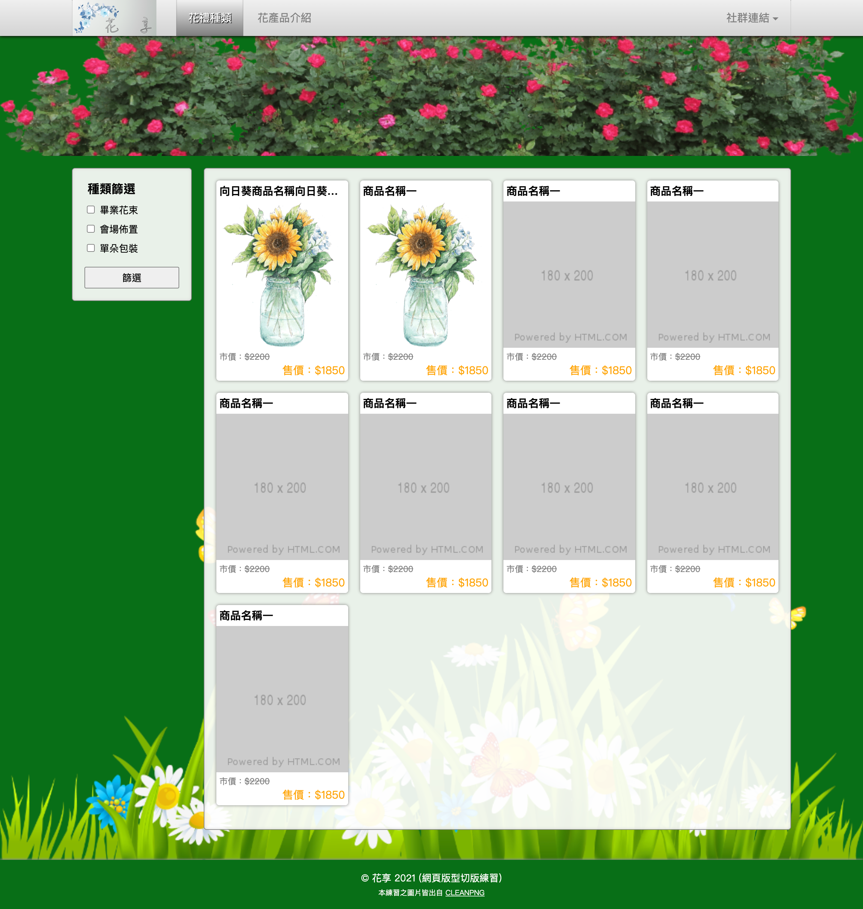
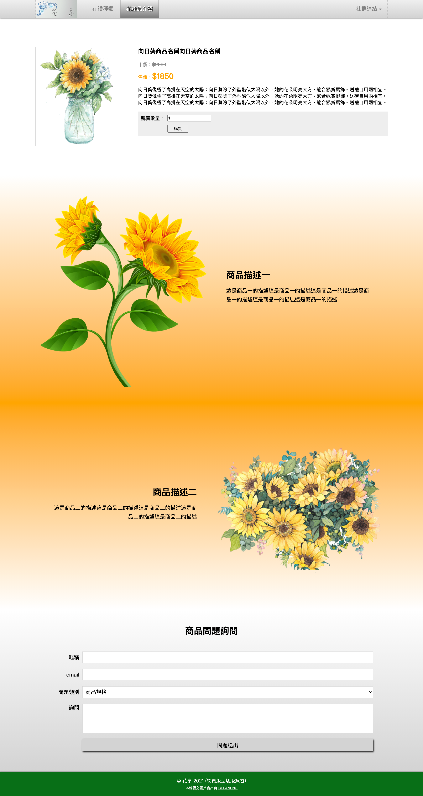
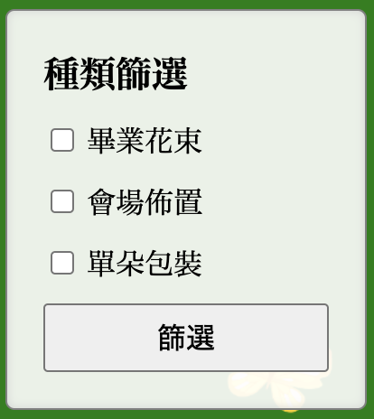

# 5 作業：網頁切版

## 作業內容

完成以下兩張圖片的切版。

1、商品列表頁

<figure><figcaption></figcaption></figure>

2、商品詳細頁


<figure><figcaption></figcaption></figure>


說明：

1、完成上面兩張圖的網頁切版，固定式版型 1200px，在頁面置中。

2、在 html\_css 資料夾裡建立一個資料夾，叫 **`assignment`** 資料夾。

3、在 assignment 資料夾裡，建立 **`images`** 資料夾，[下載圖檔](https://alldata.sgp1.digitaloceanspaces.com/sample/html\_css\_images.zip)，將圖檔放到 images 資料夾裡。

4、在 assignment 資料夾裡，建立 **`shop_list.html`** 及 **`shop_detail.html`** 兩個網頁檔。

5、在 assignment 資料夾裡，建立 **`css`** 資料夾。


## 各步驟

### 步驟一：header 區域

在兩個頁面，body 標籤裡面，放以下的結構，留意 **`-on`**：

```html
<header class="header">

  <div class="block">

    <nav class="nav">
      <a href="./shop_list.html" class="logo"></a>

      <ul class="nav_list">
        <li><a href="./shop_list.html" class="-on">花禮種類</a></li>
        <li><a href="./shop_detail.html">花產品介紹</a></li>
      </ul>

      <div class="share_block">
        <span class="share_text">社群連結</span>
        <ul class="share_list">
          <li><a href="https://www.facebook.com">FB 粉絲頁</a></li>
          <li><a href="https://instagram.com">IG 頁面</a></li>
        </ul>
      </div>

    </nav>

  </div>

</header>
```


### 步驟二：三角形、banner 區域、footer 區域

1、三角形可使用偽元素來做。


2、banner 區域結構如下，放在 **`shop_list.html`** 頁面的 **`header.header`** 元素同層的下方：

```html
<section class="banner_bg"></section>
```


3、footer 區域的結構如下，兩個網頁檔都要放，放在 **`body 結尾標籤`**之前：

```html
<footer class="footer">
  &copy; 花享 2023 (網頁版型切版練習)
  <span class="text">本練習之圖片皆出自 <a href="https://www.cleanpng.com/" target="_blank">CLEANPNG</a></span>
</footer>
```


### 步驟三：兩欄式及背景

在 `shop_list.html` 檔中的 `section.banner_bg` 元素同層的下方，放以下的結構：

```html
<div class="main_block">
  <div class="inner_block">

    <aside class="aside">aside<br>aside</aside>

    <main class="main">main</main>

  </div>
</div>
```

完成示意：

<figure><figcaption></figcaption></figure>


### 步驟四：側邊欄

在 `shop_list.html` 檔中，`aside.aside` 元素的**裡面**，放以下的結構：

```html
<h1 class="title1">種類篩選</h1>
<form action="#" method="#">
  <ul class="type_list">
    <li>
      <input type="checkbox" class="type" id="type1">
      <label for="type1">畢業花束</label>
    </li>
    <li>
      <input type="checkbox" class="type" id="type2">
      <label for="type2">會場佈置</label>
    </li>
    <li>
      <input type="checkbox" class="type" id="type3">
      <label for="type3">單朵包裝</label>
    </li>
  </ul>
  <button type="submit" class="btn_submit">篩選</button>
</form>
```

完成示意：

<figure><figcaption></figcaption></figure>


## 繳交方式

於以下網址繳交：

[https://frontend.tibame.com](https://frontend.tibame.com)

將 **`assignment 資料夾`**壓縮變成壓縮檔(zip 檔或 rar 檔)，繳交該壓縮檔即可。


## 繳交期限

繳交期限 /() 晚上 12 點之前。


## 參考作法

