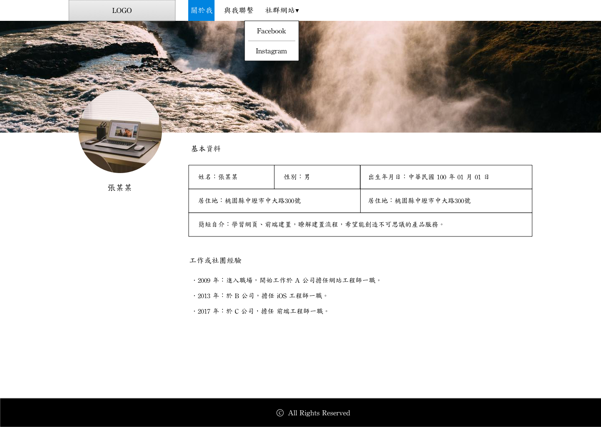
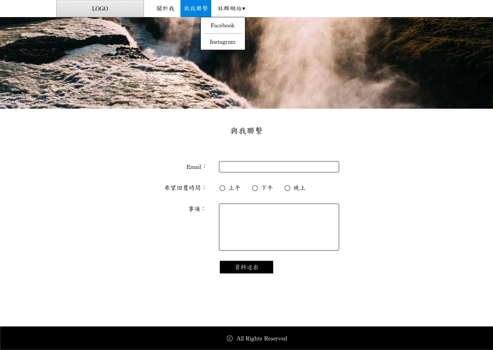

# 5. 作業二

## 作業內容

### 示意圖

關於我：

與我聯繫：

1、完成上圖兩個頁面的版排。\(圖片、內容皆可自行變更\)，檔名分別為 `index.html`、`contact.html`。

### 說明

1、在 html\_css 資料夾裡建立一個資料夾，叫 assignment2 資料夾，相關頁面、素材，都放在此資料夾裡。

2、兩個頁面的 banner 圖片為佔整個螢幕寬度滿版，而且是 css 背景圖，最小寬度為768px；高度為 268px。

3、index.html 頁面設定中間整體內容固定寬度為 768px 水平置中。contact.html 可設定整體寬度為 520px 水平置中。

4、大頭像請做在側邊欄，勿做在 header 區域。

5、[三張圖片下載](http://notes.carlos-studio.com/download/assignment_three_pictures.zip)。

\(註：以上說明皆非制式，可自由彈性變更。\)

## 繳交方式

### 方式一：Tibame 平台 \(優先使用\)

### 方式二： FTP

進到 FTP 的 「TED101作業」→「網頁入門」→「自己的學號」→ 建立「作業二」資料夾。然後將 assignment2 裡的所有東西上傳。

例：學號為 T19xxx，則：

* TED101作業/網頁入門/**T19xxx/作業二**

再將 assignment2 資料夾裡的所有東西上傳，結果範例如下：

* T19xxx/作業二/index.html
* T19xxx/作業二/contact.html
* T19xxx/作業二/css/                  ← 這是資料夾
* T19xxx/作業二/js/                     ← 這是資料夾
* T19xxx/作業二/images/           ← 這是資料夾
* T19xxx/作業二/fonts/               ← 這是資料夾

## 參考作法

[https://alldata.sgp1.digitaloceanspaces.com/sample/html\_css\_assignment2.zip](https://alldata.sgp1.digitaloceanspaces.com/sample/html_css_assignment2.zip)

