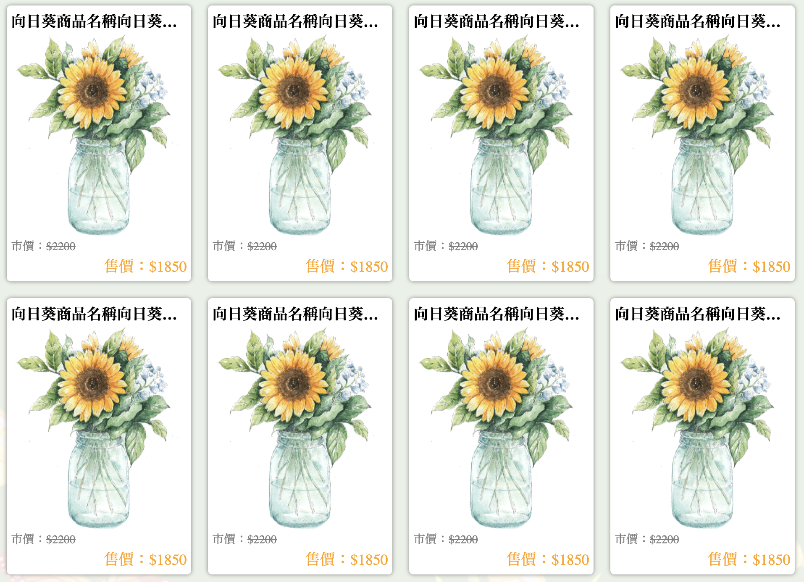
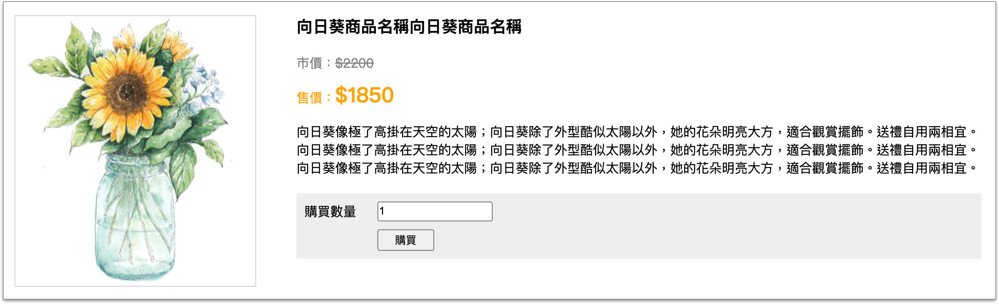
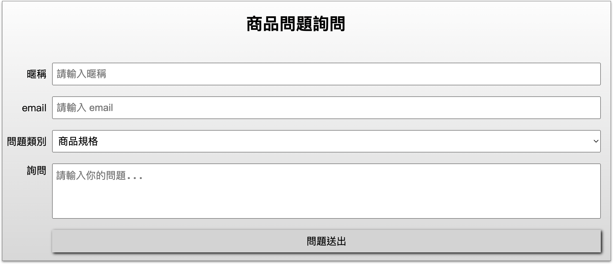

# 5 作業：網頁切版

## 作業內容

完成以下兩張圖片的切版。

1、商品列表頁

<figure><figcaption></figcaption></figure>

2、商品詳細頁


<figure><figcaption></figcaption></figure>


說明：

1、完成上面兩張圖的網頁切版，固定式版型 1200px，在頁面置中。

2、在 html\_css 資料夾裡建立一個資料夾，叫 **`assignment`** 資料夾。

3、在 assignment 資料夾裡，建立 **`images`** 資料夾，[下載圖檔](https://alldata.sgp1.digitaloceanspaces.com/sample/html\_css\_images.zip)，將圖檔放到 images 資料夾裡。

4、在 assignment 資料夾裡，建立 **`shop_list.html`** 及 **`shop_detail.html`** 兩個網頁檔。

5、在 assignment 資料夾裡，建立 **`css`** 資料夾。


## 各步驟

### 步驟一：header 區域

在兩個頁面，body 標籤裡面，放以下的結構，留意 **`-on`**：

```html
<header class="header">

  <div class="block">

    <nav class="nav">
      <a href="./shop_list.html" class="logo"></a>

      <ul class="nav_list">
        <li><a href="./shop_list.html" class="-on">花禮種類</a></li>
        <li><a href="./shop_detail.html">花產品介紹</a></li>
      </ul>

      <div class="share_block">
        <span class="share_text">社群連結</span>
        <ul class="share_list">
          <li><a href="https://www.facebook.com">FB 粉絲頁</a></li>
          <li><a href="https://instagram.com">IG 頁面</a></li>
        </ul>
      </div>

    </nav>

  </div>

</header>
```


### 步驟二：三角形、banner 區域、footer 區域

1、三角形可使用偽元素來做。


2、banner 區域結構如下，放在 **`shop_list.html`** 頁面的 **`header.header`** 元素同層的下方：

```html
<section class="banner_bg"></section>
```


3、footer 區域的結構如下，兩個網頁檔都要放，放在 **`body 結尾標籤`**之前：

```html
<footer class="footer">
  &copy; 花享 2023 (網頁版型切版練習)
  <span class="text">本練習之圖片皆出自 <a href="https://www.cleanpng.com/" target="_blank">CLEANPNG</a></span>
</footer>
```


### 步驟三：兩欄式及背景

在 `shop_list.html` 檔中的 `section.banner_bg` 元素同層的下方，放以下的結構：

```html
<div class="main_block">
  <div class="inner_block">

    <aside class="aside">aside<br>aside</aside>

    <main class="main">main</main>

  </div>
</div>
```

完成示意：

<figure><figcaption></figcaption></figure>


### 步驟四：側邊欄

在 `shop_list.html` 檔中，`aside.aside` 元素的**裡面**，放以下的結構：

```html
<h1 class="title1">種類篩選</h1>
<form action="#" method="#">
  <ul class="type_list">
    <li>
      <input type="checkbox" class="type" id="type1">
      <label for="type1">畢業花束</label>
    </li>
    <li>
      <input type="checkbox" class="type" id="type2">
      <label for="type2">會場佈置</label>
    </li>
    <li>
      <input type="checkbox" class="type" id="type3">
      <label for="type3">單朵包裝</label>
    </li>
  </ul>
  <button type="submit" class="btn_submit">篩選</button>
</form>
```

完成示意：

<figure><figcaption></figcaption></figure>


### 步驟五：主內容

在 `shop_list.html` 檔中，在 `main.main` 元素的**裡面**，放以下的結構( **`li 放 10 個`** )：

```html
<ul class="product_list">

  <li>
    <a href="./shop_detail.html">
      <h1 class="title1">向日葵商品名稱向日葵商品名稱</h1>
      <div class="img_block">
        
      </div>
      <div class="price_block">
        <div class="left_block">市價：<span class="original_price">$2200</span></div>
        <div class="right_block">售價：<span class="sell_price">$1850</span></div>
      </div>
    </a>
  </li>
  
</ul>
```

完成示意：

<figure><figcaption></figcaption></figure>


### 步驟六：詳細頁的描述區域

在 `shop_detail.html` 檔中，在 **`header.header`** 元素同層的下方，放以下結構：

```html
<section class="sec1">
  <div class="flex_container">
    <div class="items -left">
      <div class="img_block">
        
      </div>
    </div>
    <div class="items -right">
      <h1 class="title1">向日葵商品名稱向日葵商品名稱</h1>
      <ul class="desc_list">
        <li>市價：<span class="original_price">$2200</span></li>
        <li>售價：<span class="sell_price">$1850</span></li>
      </ul>
      <p>
        向日葵像極了高掛在天空的太陽；向日葵除了外型酷似太陽以外，她的花朵明亮大方，適合觀賞擺飾。送禮自用兩相宜。
        向日葵像極了高掛在天空的太陽；向日葵除了外型酷似太陽以外，她的花朵明亮大方，適合觀賞擺飾。送禮自用兩相宜。
        向日葵像極了高掛在天空的太陽；向日葵除了外型酷似太陽以外，她的花朵明亮大方，適合觀賞擺飾。送禮自用兩相宜。
      </p>

      <form class="buy_form" action="#" method="#">
        <div class="item_block">
          <label class="label_item">購買數量</label>
          <input type="number" class="buy_count" value="1" min="1">
        </div>
        <div class="item_block">
          <span class="temp"></span>
          <button type="submit">購買</button>
        </div>
      </form>

    </div>
  </div>
</section>
```

完成示意：

<figure><figcaption></figcaption></figure>


### 步驟七：左右圖文編排

在 `shop_detail.html` 檔中，`section.sec1` 同層的下方，貼以下的結構：

```html
<section class="sec2 -type1">
  <div class="flex_container">

    <div class="flex_item -img">
      
    </div>

    <div class="flex_item -text">
      <h1 class="title1">商品描述一</h1>
      <p class="para">這是商品一的描述這是商品一的描述這是商品一的描述這是商品一的描述這是商品一的描述這是商品一的描述</p>
    </div>

  </div>
</section>

<section class="sec2 -type2">
  <div class="flex_container">

    <div class="flex_item -text">
      <h1 class="title1">商品描述一</h1>
      <p class="para">這是商品一的描述這是商品一的描述這是商品一的描述這是商品一的描述這是商品一的描述這是商品一的描述</p>
    </div>

    <div class="flex_item -img">
      
    </div>

  </div>
</section>
```

完成示意：

<figure><figcaption></figcaption></figure>


### 步驟八：表單編排

在 `shop_detail.html` 檔中，在 `section.sec2.-type2` 元素同層的下方，放以下的結構：

```html
<section class="sec_form">
  <h1 class="title1">商品問題詢問</h1>
  <form class="q_form" action="#" method="#">
  
    <div class="item_block">
      <label>暱稱</label>
      <input type="text" placeholder="請輸入暱稱">
    </div>
  
    <div class="item_block">
      <label>email</label>
      <input type="text" placeholder="請輸入 email">
    </div>
  
    <div class="item_block">
      <label>問題類別</label>
      <select>
        <option>商品規格</option>
        <option>退貨</option>
        <option>保存相關</option>
      </select>
    </div>
  
    <div class="item_block -text">
      <label>詢問</label>
      <textarea class="q_text" placeholder="請輸入你的問題..."></textarea>
    </div>
  
    <div class="item_block">
      <label></label>
      <button type="submit">問題送出</button>
    </div>
  
  </form>
</section>
```

完成示意：

<figure><figcaption></figcaption></figure>


完成。


## 繳交方式

於以下網址繳交：

[https://frontend.tibame.com](https://frontend.tibame.com)

將 **`assignment 資料夾`**壓縮變成壓縮檔(zip 檔或 rar 檔)，繳交該壓縮檔即可。


## 繳交期限

繳交期限： **08/31(四) 晚上 12 點之前**。


## 參考作法

